  

<h1 align="center">Hi, I'm Andrei Văleanu</h1>

  <em>Software Engineering student at the Faculty of Automatic Control and Computers, 
  University Politehnica of Bucharest (UPB ACS)</em>

  
  
  
  

---

## About Me

I am a **creative, hard-working, organised and detail-oriented** Software Engineering student with strong programming skills in **C, C++, Racket, Haskell, Java, MATLAB** and **x86 Assembly** (both 32-bit and 64-bit). I am **fluent in English and German**, hold **international certifications**, and have a deep, ongoing interest in **Artificial Intelligence**.

My academic interests include:

> Software Engineering · Computer Architecture · Embedded Systems · Algorithms and Data Structures · Artificial Intelligence · Database Systems · Computer Graphics · System Reliability

I actively consolidate knowledge from lectures, laboratories, technical documentation, books and self-created study materials — transforming information from multiple sources into structured understanding and practical solutions.

---

## Technical Evolution & Vision

> Beyond the core programming languages, my expertise bridges the gap between **high-level abstraction** and **hardware-level precision**. Whether I am optimizing **x86 Assembly**, architecting complex systems in **C/C++**, working with **SQL, NoSQL and MySQL**, or training neural networks using **PyTorch**, I approach code as a tool for solving real-world engineering puzzles.

---

## What I Bring to the Table

### Deep Systems Engineering
Proficient in **Embedded Systems** (ARM, FPGA, VHDL) and **Operating Systems**, with a solid grasp of **Real-Time Security** and **Computational Fluid Dynamics**.

### AI & Intelligent Automation
Actively developing in **Machine Learning** and **Genetic Algorithms**, leveraging **Python, CUDA and Jupyter** to build the next generation of smart software.

### Network Orchestration
Certified-level knowledge in **CCNA Security** and **Cisco Routing/Switching**, ensuring that every application I build is scalable and network-aware.

### Creative Logic
I blend the rigors of **Functional Programming** (Haskell, Racket) with the visual creativity of **OpenGL** and **Game Development** (Fusion 360, Pygame).

---

## The Mindset

> I do not just write code — **I refactor reality**. My background in **Automatic Control** has trained me to see patterns where others see chaos. From **Mathematical Problem Solving** to **Parallel Computing**, I thrive in environments that demand both **analytical depth** and **rapid adaptation**.

> *"The best way to predict the future is to program it."*
>
> *"The best solutions are often found where intuition and unconventional thinking meet."*

**Currently seeking challenges that push the boundaries of Artificial Intelligence and Embedded Software Engineering.**

---

## Tech Stack

**Languages**

**AI / ML**

**Systems & Hardware**

**Graphics & Game Dev**

**Networking & Tooling**

---

## Featured Projects

> A selection of recent work. Full list at [github.com/AndreiValeanu22?tab=repositories](https://github.com/AndreiValeanu22?tab=repositories).

### Artificial Intelligence & Machine Learning

- **[DL-SkinLesion-FaceEmotion-Classification](https://github.com/AndreiValeanu22/DL-SkinLesion-FaceEmotion-Classification)** — End-to-end PyTorch image classification on two imbalanced datasets (skin lesions + face emotions). MLP, CNN, ResNet-18, MobileNet-V2 and EfficientNet-B0 with RandAugment, WeightedRandomSampler, per-dataset TTA and F1-weighted ensemble.
- **[ML-OUALD-Classification-Regression](https://github.com/AndreiValeanu22/ML-OUALD-Classification-Regression)** — Classification + regression on the Open University Learning Analytics Dataset. CatBoost / XGBoost blend, multi-seed ensembling, OOF stacking. **Kaggle bonus: rank 24.**
- **[Artificial-Inteligence_CTI_Laboratories](https://github.com/AndreiValeanu22/Artificial-Inteligence_CTI_Laboratories)** — Lab work for the AI course (CTI).

### Systems, HPC & Embedded

- **[CUDA-labs](https://github.com/AndreiValeanu22/CUDA-labs)** — 8 ASC labs on HPC, CPU microarchitecture, cache optimization, CUDA (tiled matmul, atomics, dynamic parallelism, GPU sort, Gaussian blur). Benchmarked on UPB HPC (NVIDIA A100/P100).
- **[ProiectTSC_2026](https://github.com/AndreiValeanu22/ProiectTSC_2026)** — *InkTime*: BLE e-paper wearable. Full hardware design in Autodesk Fusion Electronics (schematic + 4-layer PCB + manufacturing package) around an nRF52840.
- **[SISTEM-INTELIGENT-DE-MONITORIZARE-...-CAMERA-TEHNICA](https://github.com/AndreiValeanu22/SISTEM-INTELIGENT-DE-MONITORIZARE-SI-AVERTIZARE-PENTRU-CAMERA-TEHNICA)** — Arduino Uno smart monitoring system with 7 sensors, priority-based state machine, RTC-timestamped CSV logging.

### Computer Graphics & Game Development

- **[Computer-Graphics-UPB](https://github.com/AndreiValeanu22/Computer-Graphics-UPB)** — All EGC assignments: 2D OpenGL Arcade Launcher (Tema 1), 3D Train & Terrain Simulation (Tema 2), Firefly Forest with shaders (Tema 3).

### Networking, Parallel & Distributed

- **[APD-Projects](https://github.com/AndreiValeanu22/APD-Projects)** — Java thread-pool news article database (Tema 1) and distributed CHORD DHT in C + MPI (Tema 2).
- *Ethernet Switch (MAC learning, custom 802.1Q VLANs, Poli STP)* and *Dataplane IPv4 Router (LPM, ARP, ICMP)* — RL labs, 70/100 and **100/100** respectively.

### Databases

- **[awesome-sql-databases](https://github.com/AndreiValeanu22/awesome-sql-databases)** — SQL database labs (2026).

### TSC Laboratories

- **[git-lab](https://github.com/AndreiValeanu22/git-lab)** · **[tsc-lab5-6-7](https://github.com/AndreiValeanu22/tsc-lab5-6-7)** · **[tsc-lab8-9-10](https://github.com/AndreiValeanu22/tsc-lab8-9-10)**

---

## Competitions & Hackathons

- **Kaggle Energy Trading Hackathon 2025** — team competition, **12th place overall**. Applied ML, data analysis and predictive modeling.
- **Kaggle bonus — IA Tema 1 (OUALD), 2026** — **rank 24** on the public leaderboard (classification + regression).

---

## Strengths

`Continuous Learning` · `Knowledge Synthesis` · `Research-Oriented Mindset` · `Analytical Thinking` · `Eye for Detail` · `Strong Problem-Solving` · `Team Collaboration` · `Effective Communication` · `Time Management` · `Debugging` · `System Design` · `Adaptability` · `Technical Curiosity`

---

## Languages

| Language | Level |
|----------|-------|
| Romanian | Native |
| English  | Fluent (C1) |
| German   | Intermediate (B2) |

---

## Certifications

- IC3 Digital Literacy Certification — June 2021
- CCNA Routing and Switching: Introduction to Networks — May 2020
- IT Essentials — June 2019

---

## GitHub Stats

  

---

## Additional Note

> My GitHub profile is a **living portfolio** — it contains many of my latest projects, experiments and technical developments that may not yet be reflected in my CV. I encourage you to explore [github.com/AndreiValeanu22](https://github.com/AndreiValeanu22) for the most current representation of my technical work and ongoing learning journey.

---

  <em>"If you're goin' hard enough left, you'll find yourself turnin' right." &mdash; Doc Hudson</em>

